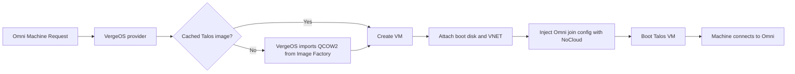

# Omni Infrastructure Provider for VergeOS

A community infrastructure provider that lets [Sidero Omni](https://docs.siderolabs.com/omni/) create, scale, and delete [Talos Linux](https://www.talos.dev/) virtual machines on [VergeOS](https://docs.verge.io/).

> [!IMPORTANT]
> This project is community maintained and is not an official Sidero Labs or Verge.io product. It is currently an **alpha release**. Test it in a non-production environment before relying on it for critical clusters.

## Features

- Dynamic VM provisioning from Omni Machine Requests
- Clean scale-up, scale-down, and deprovisioning
- Automatic Talos Image Factory downloads performed directly by VergeOS
- Image caching by Talos version, architecture, and Omni schematic
- Omni-controlled system extensions and Talos versions
- Optional use of an existing VergeOS image file
- UEFI, NoCloud, VirtIO networking, and configurable boot storage
- Docker Compose and Kubernetes deployment examples
- API-key or username/password authentication to VergeOS

## How it works



Omni selects the Talos version and resolves the applicable system extensions into an Image Factory schematic. The provider converts that schematic into a `nocloud-amd64.qcow2` URL, asks VergeOS to import it, caches the file, and uses it as the source for each VM boot disk.

When Omni no longer needs a machine, the provider powers it off and removes its NICs, drives, and VM. Shared cached Talos images are retained for reuse.

## Requirements

- An Omni instance with administrator access
- A VergeOS environment reachable from the provider container
- Docker or Kubernetes to run the provider
- A dedicated VergeOS API user and API key
- DNS and HTTPS access from VergeOS to the configured Talos Image Factory
- Network access from provisioned Talos VMs to the Omni endpoints required by your deployment
- `amd64` virtualization hosts

The provider currently supports `amd64` only.

## Quick start

### 1. Register the provider in Omni

The service-account name must match the provider ID. The default provider ID is `vergeos`.

```bash
omnictl infraprovider create vergeos
```

Save the returned `OMNI_ENDPOINT` and `OMNI_SERVICE_ACCOUNT_KEY` values.

You can also create the provider from **Settings → Infra Providers** in the Omni UI.

### 2. Create a VergeOS API key

Create a dedicated VergeOS user, grant only the permissions required by the provider, and create an API key for that user. See [Installation](docs/installation.md#2-create-a-vergeos-service-account-and-api-key) for the required operations.

### 3. Configure the provider

```bash
cp deploy/example.env deploy/.env
chmod 600 deploy/.env
```

Edit `deploy/.env`:

```dotenv
PROVIDER_IMAGE=ghcr.io/OWNER/omni-infra-provider-vergeos:VERSION
OMNI_ENDPOINT=https://omni.example.com
OMNI_SERVICE_ACCOUNT_KEY=replace-me
VERGEOS_ENDPOINT=https://vergeos.example.com
VERGEOS_API_KEY=replace-me
TALOS_IMAGE_FACTORY_BASE_URL=https://factory.talos.dev
```

### 4. Start the provider

```bash
cd deploy
docker compose up -d
docker compose logs -f omni-infra-provider-vergeos
```

The provider exposes no listening port. It only makes outbound connections to Omni and VergeOS.

### 5. Create a VergeOS-backed Machine Class

In Omni, create a dynamic Machine Class using the registered VergeOS provider. Paste provider data similar to:

```yaml
cluster_id: 1
vnet_id: 42
architecture: amd64
cores: 4
memory: 8192
disk_size: 32
preferred_tier: "3"
cpu_type: host
disk_interface: virtio-scsi
network_interface: virtio
uefi: true
```

Do not set `image_file_id` when you want automatic Image Factory integration.

### 6. Create a cluster

Reference the Machine Class from the Omni UI or a cluster template:

```yaml
kind: Cluster
name: vergeos-example
kubernetes:
  version: v1.36.1
talos:
  version: v1.13.2
systemExtensions:
  - siderolabs/hello-world-service
---
kind: ControlPlane
machineClass:
  name: vergeos-control-plane
  size: 3
---
kind: Workers
name: workers
machineClass:
  name: vergeos-workers
  size: 3
```

Validate and apply it:

```bash
omnictl cluster template validate -f cluster.yaml
omnictl cluster template sync -f cluster.yaml --verbose
omnictl cluster template status -f cluster.yaml
```

Use Talos and Kubernetes versions supported by your Omni release. The versions above are examples, not release requirements.

## System extensions and image selection

You normally do **not** select a fixed installation image in VergeOS. Configure `systemExtensions` in Omni instead. Omni generates a new schematic whenever the Talos version, extensions, or image-affecting configuration changes. The provider then imports or reuses the exact QCOW2 required by that schematic.

See [Images and system extensions](docs/images-and-extensions.md).

## Documentation

- [Installation](docs/installation.md)
- [Configuration reference](docs/configuration.md)
- [Using the provider](docs/usage.md)
- [Images and system extensions](docs/images-and-extensions.md)
- [Troubleshooting](docs/troubleshooting.md)
- [Architecture and lifecycle](docs/architecture.md)
- [Compatibility and limitations](docs/compatibility.md)
- [Development and releases](docs/development.md)
- [Support](SUPPORT.md)
- [Security policy](SECURITY.md)
- [Contributing](CONTRIBUTING.md)

## Building from source

```bash
docker build --pull --no-cache \
  -t omni-infra-provider-vergeos:local \
  .
```

Or use Go directly:

```bash
go mod tidy
go test ./...
go build -o _out/omni-infra-provider-vergeos \
  ./cmd/omni-infra-provider-vergeos
```

The required Go version is declared in `go.mod`.

## Release status

The following lifecycle has been validated in a live environment:

- VM creation from Omni
- Automatic registration with Omni
- Scale-up
- Scale-down
- Complete removal of VM NICs, drives, and VM objects
- Automatic Image Factory import and cache reuse

Review [Compatibility and limitations](docs/compatibility.md) before production use.

## License

This project is licensed under the [Mozilla Public License 2.0](LICENSE).

The provider follows patterns from the Sidero Labs KubeVirt infrastructure provider and uses the official VergeOS Go SDK. See [NOTICE.md](NOTICE.md) for attribution.
