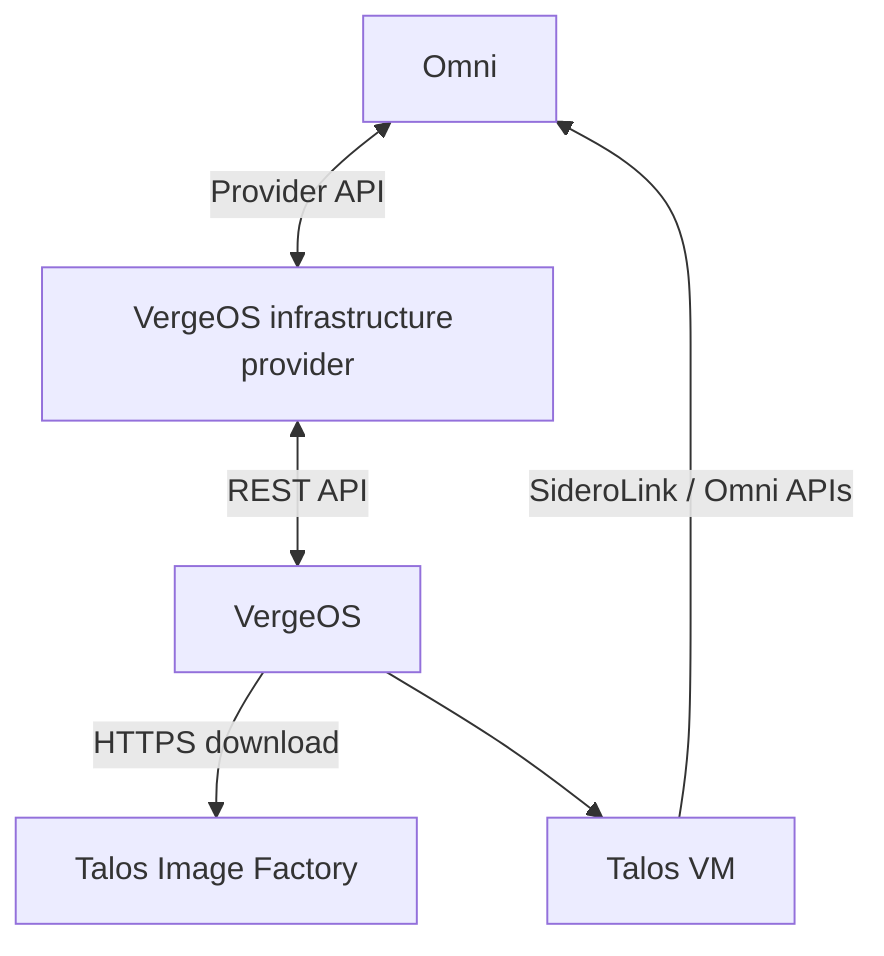
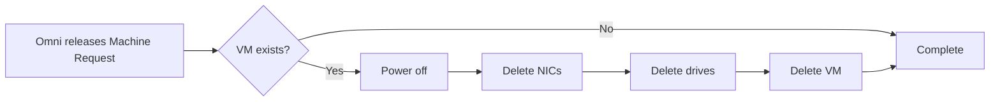

# Architecture and lifecycle

## Components

The provider is a stateless reconciliation service with a small amount of machine lifecycle state stored through Omni's infrastructure-provider framework.

## Provisioning steps

The provider registers these ordered steps:

1. `validateRequest`
2. `createSchematic`
3. `ensureTarget`
4. `ensureImage`
5. `syncMachine`

### `validateRequest`

- Validates the Machine Request name length.
- Decodes provider data.
- Applies defaults.
- Validates cluster, VNET, architecture, CPU, memory, disk, and image override values.

### `createSchematic`

- Asks Omni to generate the Image Factory schematic.
- Adds the serial console kernel argument `console=ttyS0,38400n8`.
- Records the schematic and Talos version in provider machine state.
- Requests a join-config workflow rather than embedding Omni connection parameters in the image.

### `ensureTarget`

- Confirms the VergeOS cluster exists.
- Confirms the VergeOS VNET exists.

No VM is created until target validation succeeds.

### `ensureImage`

Manual mode:

- Reads the specified `image_file_id`.

Automatic mode:

- Builds the exact Image Factory QCOW2 URL.
- Derives a deterministic cache filename.
- Reuses a valid cached file or starts a VergeOS URL import.
- Waits until the file reports a non-zero size.
- Stores the selected VergeOS file ID in provider state.

A per-process mutex reduces duplicate concurrent imports for the same cache name. This lock is not distributed, which is why a single provider replica is recommended.

### `syncMachine`

- Finds the VM by Omni Machine Request ID.
- Creates the VM if missing.
- Ensures `disk0` exists and is imported from the selected cached file.
- Ensures `nic0` exists on the selected VNET.
- Powers on the VM.

The VM receives:

- Omni Machine Join Config as NoCloud `user-data`
- Instance metadata as `meta-data`
- Minimal NoCloud `network-config`

Network addressing is expected to come from the selected VNET, normally through DHCP.

## Idempotency

Repeated reconciliation uses deterministic identifiers:

| Resource | Identity |
| --- | --- |
| VM | Omni Machine Request ID as VM name |
| Boot disk | `disk0` |
| Primary NIC | `nic0` |
| Cached image | Hash of the complete Image Factory asset URL |

If the provider restarts after partially completing an operation, it inspects VergeOS and continues from the existing resources.

## Deprovisioning

Cached Talos files are intentionally not deleted.

## Provider state

The machine state records:

- VergeOS VM UUID
- Selected VergeOS image file ID
- Omni schematic ID
- Talos version

The generated protobuf resource follows the same broad pattern used by other Omni infrastructure providers.

## Security boundaries

- The Omni service-account key authorizes the provider to operate as its registered provider ID.
- The VergeOS API key controls infrastructure access.
- Machine Join Config is sent to VergeOS as VM cloud-init data.
- VergeOS downloads images directly from Image Factory.
- The provider exposes no inbound network service.

Protect the Omni key and VergeOS API key as high-value secrets.
